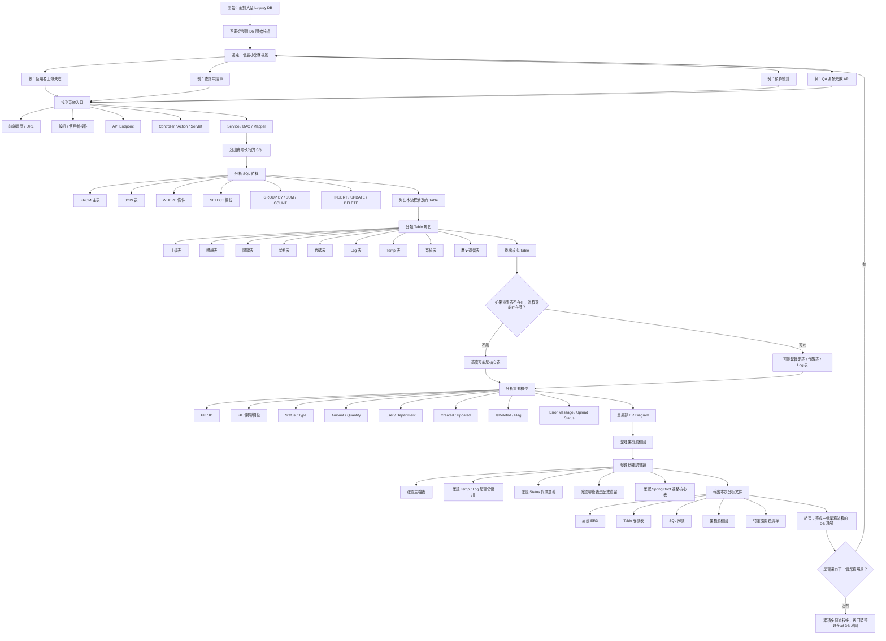

---

# Table 分析紀錄

## 一、基本資訊

- 業務場景：
- 畫面 / 功能：
- API：
- 後端入口：
- SQL 位置：

---

## 二、涉及 Table 清單

| Table Name | 初步類型 | 分數 | 判斷理由 | 主要欄位 | 被哪支 API / SQL 使用 | 疑問 |
| --- | --- | --- | --- | --- | --- | --- |
|  | 主檔 / 明細 / 代碼 / Log / Temp / 系統 / 歷史 / 主資料 / 報表 |  |  |  |  |  |

---

## 三、重要欄位分析

| Table Name | Column Name | 推測意義 | 是否影響業務邏輯 | 備註 |
| --- | --- | --- | --- | --- |
|  |  |  | 是 / 否 |  |

---

## 四、SQL 解讀 (SQL 位置)

---

---

# The Role of a Table

## 主檔表 / Header 表評量 `極高`

- 一個業務流程的主要資料主體，代表一張單、一個案件、一筆申請、一個批次
- 如果這張表不存在，這個業務流程還能不能存在？

| 評量條件 | 是否符合 |
| --- | --- |
| 是否代表一筆完整業務主體？ | 是 / 否 |
| 是否有單號、案號、申請編號？ | 是 / 否 |
| 是否有 status？ | 是 / 否 |
| 是否有 created_by、created_time？ | 是 / 否 |
| 是否是查詢列表的主要來源？ | 是 / 否 |
| 是否是新增流程第一個寫入的正式表？ | 是 / 否 |
| 是否有多張明細表或 log 表依附它？ | 是 / 否 |

```
符合 5 項以上：高度可能是主檔表
符合 3～4 項：可能是重要業務表
符合 0～2 項：通常不是主檔表
```

## 明細表 / Detail 表評量 `高`

- 主檔底下的一行一行項目，一筆主檔通常對應多筆明細
- 這張表是否依附在某張主檔表底下？

| 評量條件 | 是否符合 |
| --- | --- |
| 是否有 `main_id`、`apply_id`、`order_id`、`header_id`？ | 是 / 否 |
| 是否多筆資料對應一筆主檔？ | 是 / 否 |
| 是否有 item、quantity、amount、price 類欄位？ | 是 / 否 |
| 是否通常不單獨存在？ | 是 / 否 |
| 是否需要 JOIN 主檔才有完整業務意義？ | 是 / 否 |

```
符合 4 項以上：高度可能是明細表
符合 2～3 項：可能是子表 / 附屬表
符合 0～1 項：通常不是明細表
```

## 關聯表 / Mapping 表評量 `中到高`

- 用來連接兩張或多張表，通常處理多對多關係
- 這張表是不是主要只存兩個或多個外鍵？

| 評量條件 | 是否符合 |
| --- | --- |
| 是否主要由兩個以上 ID 組成？ | 是 / 否 |
| 是否沒有太多自己的業務欄位？ | 是 / 否 |
| 是否用來連接兩張主表或基礎表？ | 是 / 否 |
| 是否處理多對多關係？ | 是 / 否 |
| 表名是否有 `map`、`mapping`、`rel`、`relation`？ | 是 / 否 |

```
符合 4 項以上：高度可能是關聯表
符合 2～3 項：可能是關聯表，但要確認是否有業務意義
符合 0～1 項：通常不是關聯表
```

## 狀態表 / Workflow Status 表表評量 `高`

- 定義業務流程的狀態、階段、流轉邏輯
- 這張表是否表示流程走到哪一步？

| 評量條件 | 是否符合 |
| --- | --- |
| 是否有 status_code / status_name？ | 是 / 否 |
| 是否表示流程階段？ | 是 / 否 |
| 是否和審核、送出、退回、完成、取消有關？ | 是 / 否 |
| 是否被主檔表的 status 欄位引用？ | 是 / 否 |
| 是否可能影響下一步流程？ | 是 / 否 |

```
符合 4 項以上：高度可能是狀態表
符合 2～3 項：可能是代碼表中的狀態分類
符合 0～1 項：通常不是狀態表
```

## 代碼表 / Code 表評量 `中`

- 將系統代碼翻譯成人可以理解的文字，常用於下拉選單、狀態名稱、類型名稱
- 這張表是否主要用來把 code 轉成 name？

| 評量條件 | 是否符合 |
| --- | --- |
| 是否有 code_type、code_value、code_name？ | 是 / 否 |
| 是否用來顯示中文名稱或描述？ | 是 / 否 |
| 是否常被 JOIN 來補名稱？ | 是 / 否 |
| 是否用於下拉選單？ | 是 / 否 |
| 是否一張表中存很多種類型的代碼？ | 是 / 否 |

```
符合 4 項以上：高度可能是代碼表
符合 2～3 項：可能是參數表 / lookup table
符合 0～1 項：通常不是代碼表
```

## Log 表評量 `視情況`

- 記錄事件、操作、錯誤、歷史軌跡
- 這張表是否主要在記錄「發生過什麼事」？

| 評量條件 | 是否符合 |
| --- | --- |
| 是否記錄事件、錯誤、操作紀錄？ | 是 / 否 |
| 是否有 action、message、error_message？ | 是 / 否 |
| 是否有 operator、created_time、ip？ | 是 / 否 |
| 是否資料量可能很大？ | 是 / 否 |
| 是否通常只新增、不修改？ | 是 / 否 |

```
符合 4 項以上：高度可能是 Log 表
符合 2～3 項：可能是流程紀錄表
符合 0～1 項：通常不是 Log 表

approval_log / workflow_log 雖然叫 log，
但如果它影響審核結果，就不是單純除錯資料，而是重要業務資料。
```

## Temp 表評量 `中`

- 暫時存放中間資料，常見於匯入、批次、轉檔、驗證流程
- 這張表的資料是否只是進正式表之前的中間狀態？

| 評量條件 | 是否符合 |
| --- | --- |
| 表名是否有 temp、tmp、staging、import？ | 是 / 否 |
| 是否用於 Excel / CSV / 批次匯入？ | 是 / 否 |
| 是否資料最後會轉進正式表？ | 是 / 否 |
| 是否有 batch_id、row_no、validate_status？ | 是 / 否 |
| 是否可能定期清除？ | 是 / 否 |

```
符合 4 項以上：高度可能是 Temp 表
符合 2～3 項：可能是批次中間表
符合 0～1 項：通常不是 Temp 表
```

## 系統表評量 `中到高`

- 支撐系統運作的基礎表，例如帳號、角色、權限、選單、系統設定
- 這張表是否不是單一業務，而是整個系統共用？

| 評量條件 | 是否符合 |
| --- | --- |
| 是否管理帳號、角色、權限？ | 是 / 否 |
| 是否管理選單、按鈕、路由？ | 是 / 否 |
| 是否管理部門、組織、系統設定？ | 是 / 否 |
| 是否被很多業務流程共用？ | 是 / 否 |
| 表名是否有 sys、system、auth、permission？ | 是 / 否 |

```
符合 4 項以上：高度可能是系統表
符合 2～3 項：可能是共用基礎表
符合 0～1 項：通常不是系統表
```

## 歷史遺留表評量 `低到高，需確認`

- 舊版本、備份、歷史流程留下來的表，目前不一定還在正式流程使用
- 這張表是否可能是舊流程、備份、搬遷留下來的？

| 評量條件 | 是否符合 |
| --- | --- |
| 表名是否有 old、bak、backup、legacy、history、年份？ | 是 / 否 |
| 是否很久沒有新增資料？ | 是 / 否 |
| 是否很少被目前程式碼查詢？ | 是 / 否 |
| 是否欄位結構像新版表的舊版本？ | 是 / 否 |
| 是否沒有人明確知道用途？ | 是 / 否 |

```
符合 4 項以上：高度可能是歷史遺留表
符合 2～3 項：需要詢問學長姐
符合 0～1 項：通常不是歷史遺留表

歷史遺留表不能自己刪，也不能自己判斷沒用。
只能標記為「疑似歷史遺留」，再詢問。
```

## 主資料表 / Master Data 表評量 `高`

- 被多個業務流程引用的基礎資料，例如商品、客戶、供應商、部門、禮品資料
- 這張表是否不是流程本身，而是被流程引用的資料？

| 評量條件 | 是否符合 |
| --- | --- |
| 是否被多個業務流程引用？ | 是 / 否 |
| 是否代表商品、禮品、客戶、供應商、部門等基礎資料？ | 是 / 否 |
| 是否不是流程本身，而是流程使用的對象？ | 是 / 否 |
| 是否有 name、type、status、effective_date？ | 是 / 否 |
| 是否修改頻率比交易資料低？ | 是 / 否 |

```
符合 4 項以上：高度可能是主資料表
符合 2～3 項：可能是基礎資料表
符合 0～1 項：通常不是主資料表
```

## 報表表 / Summary 表評量 `中`

- 儲存計算後的統計、彙總、報表結果
- 這張表是否主要存 SUM、COUNT、統計結果？

| 評量條件 | 是否符合 |
| --- | --- |
| 是否儲存統計結果？ | 是 / 否 |
| 是否有 total、count、sum、amount、period？ | 是 / 否 |
| 是否資料由其他正式表計算而來？ | 是 / 否 |
| 是否主要給報表頁面使用？ | 是 / 否 |
| 是否有 year、month、quarter 等期間欄位？ | 是 / 否 |

```
符合 4 項以上：高度可能是報表表
符合 2～3 項：可能是彙總表
符合 0～1 項：通常不是報表表
```

---
